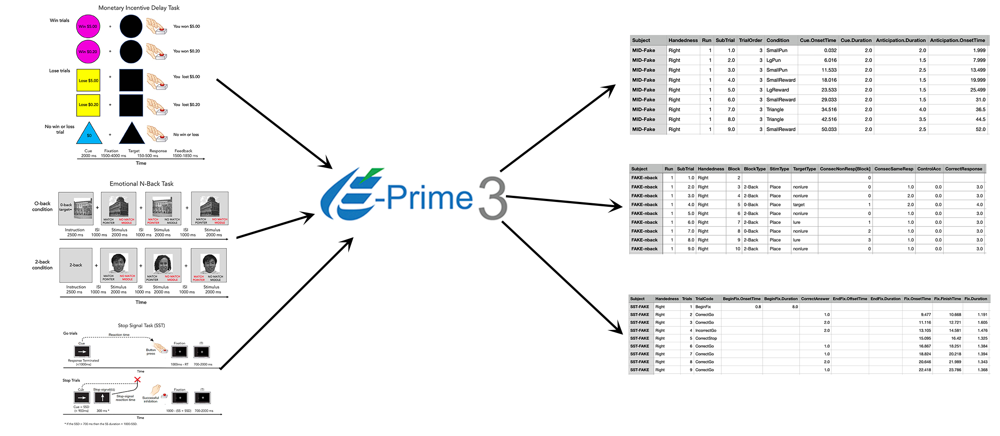
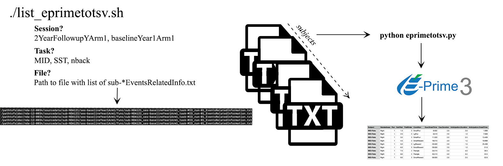
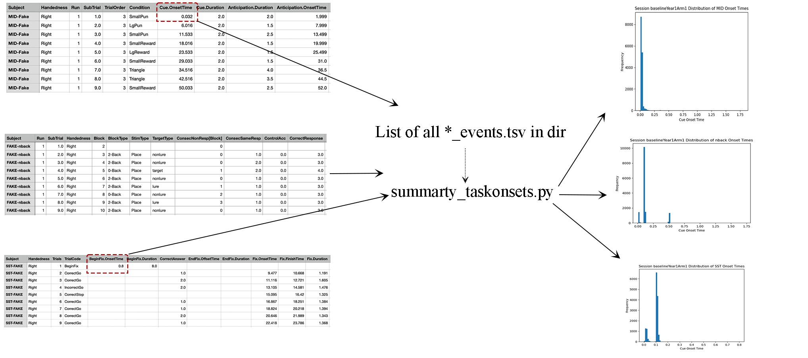
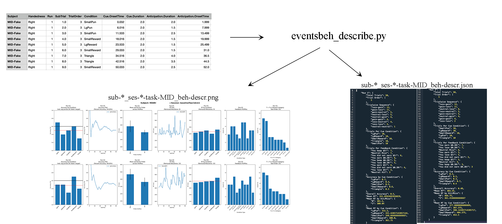
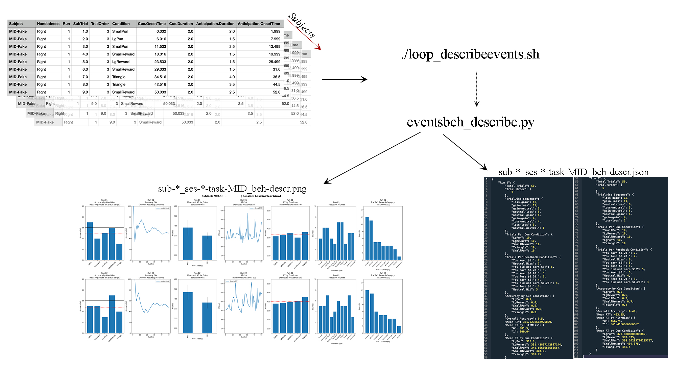

# ABCD-BIDS - convert & describe e-prime behavioral data

This is a working folder building on scripts for the [ABCD-BIDS dataset](https://collection3165.readthedocs.io/en/stable/).

The current scripts span **two separate categories**. It is recommended to run the first set of steps in a separate folder (e.g., `events_to_tsv`) 
than the second set (e.g., `tsv_to_html`).
The columns that are extracted from e-prime files ("keep_cols"), the conversion to onsets time to seconds ("time_subtract), and
the conversion of duration to seconds ("duration_subtract)" is maintained in [task_columns.json](./scripts/task_columns.json)

To simplify the code base, the `MakeFolder` bash script can be run using bash MakeFolders and the events_to_tsv and tsv_to_html
folders, subfolders + associated scripts will be moved to expedite the process.

---
<span style="color:red">**Important**</span>

April 18, 2024: A modification was made to the calculation of event onsets times in the MID task. Previously, 
the *PrepTime.Offset* window was used given a misunderstanding of e-prime having a 2000ms wait window once the task is triggers 
after the calibration volumes. The revised script now uses *PrepTime.OnsetTime* rather than the *PrepTime.Offset* window. 
This is a difference of 2000ms and may not have appeared obvious in group level maps at testing.

May 14, 2024: It was confirmed on May 9th by the ABCD consortium that the task-scanner protocols differed slightly between
GE and SIEMENS/Philips scanners. Specifically, the task tasks at the last dummy volume in GE data but last dummy volume 
+1 TR in the SIEMENS/Philips scanners. In the ABCD pipeline this resulted in timings that differed 300-800ms across tasks 
and previous version of `eprimetotsv.py` resulted in SIEMENS/Philips timing files to be 800ms. This is now corrected by 
including scanner label into `eprimetotsv.py`

-----
-----

**First, curating and summarizing e-prime behavioral data**. This includes converting e-prime files to .tsv for each subject and run, 
as well as creating numerical (.json) and visual (.png) subject-specific summaries.

1. [eprimetotsv.py](./scripts/eprimetotsv.py): Converts edat/edat2 E-prime *EventsRelatedInformation.txt files pulled from NDA to *_events.tsv files.
   Example usage:
     ```bash
     python ./scripts/eprimetotsv.py -i /path/inputeritxt -o /path/outputeventstsv -s NDA123XCC -e baselineYear1Arm1 -r 01 -t MID -z GE
      ```
   

2. [list_eprime_to_tsv.sh](./scripts/misc/list_eprimetotsv.sh) to process a list of files
   - runs on each subject's e-prime file separately.
   

3. [summary_taskonsets.py](./scripts/misc/summary_taskonsets.py): Sanity check to ensure the distribution of onsets for tasks is within an expected range.
   - These checks are performed after step 1, and the *_events.tsv files are generated.
   Example usage:
     ```bash
     python ./scripts/summary_taskonsets.py -i /path/dir-tsv-export -o /path/summary -t MID
     ```
     

**Second**, the following steps involve behavioral data summarization and HTML report generation.

1. [eventsbeh_describe.py](./scripts/eventsbeh_describe.py): Script that summarizes metrics from subject and run-specific task events.tsv files, generating summary .json files and .png images.
   - Runs on individual subjects via:
     ```bash
     python ./scripts/eventsbeh_describe.py -i /path/input-events/ -o /path/output-jsonpngs -s NDA123XCC -e baselineYear1Arm1 -t MID
     ```
     


2. [loop_describeevents.sh](./scripts/misc/loop_describeevents.sh): Script that loops over a list of subjects and describes
describes .tsv files iteratively. Asks for the task and session and assumes location based on current directory (review path setup)
    ```bash
    ./loop_describeevents.sh 
   ```
   

4. [run_htmlreport.py](./scripts/run_htmlreport.py): A script that calls multiple scripts to generate a `group_{task}.csv` and `group_{html}.html`.
   Based on plotting features from [nipreps/mriqc](https://github.com/nipreps/mriqc/). Run the script using:
     ```bash
     python -m ./scripts/run_htmlreport -t MID -i ./baselineYear1Arm1_MID/ -d ./scripts/templates/describe_report_MID.txt -o out_html/
     ```
   - The `-d` flag requires a descriptive file that can be updated, which exists within [scripts/templates](./scripts/templates/).
   

**Caveats:**
- The behavioral `*_events.tsv` files are calculated with the onset time of the first trial associated with the task (not scanner) trigger time.
- The raw BOLD data may include calibration volumes, which may need to be trimmed using a script like [modify_volumesrows.sh](./scripts/misc/modify_volumesrows.sh).

These scripts are a work in progress and will change (some more than others). Currently, the scripts do not reflect the core ABCC procedures.


**Contributions:**
If you catch any errors, please let me know. Some of these scripts have been used and feedback has been provided (Thanks, Farzane Lal Khakpoor!) 
but others may have not. 
If you have expertise in the MID, SST and/or nback task(s), please feel free to contribute to the descriptive text in 
[MID text](./scripts/templates/describe_report_MID.txt), [SST text](./scripts/templates/describe_report_SST.txt) and
[nback](./scripts/templates/describe_report_nback.txt)


### References

```bash
Casey, B. J., Cannonier, T., Conley, M. I., Cohen, A. O., Barch, D. M., Heitzeg, M. M., Soules, M. E., Teslovich, T., Dellarco, D. V., Garavan, H., Orr, C. A., Wager, T. D., Banich, M. T., Speer, N. K., Sutherland, M. T., Riedel, M. C., Dick, A. S., Bjork, J. M., Thomas, K. M., … ABCD Imaging Acquisition Workgroup. (2018). The Adolescent Brain Cognitive Development (ABCD) study: Imaging acquisition across 21 sites. Developmental Cognitive Neuroscience, 32, 43–54. https://doi.org/10.1016/j.dcn.2018.03.001
Chaarani, B., Hahn, S., Allgaier, N., Adise, S., Owens, M. M., Juliano, A. C., Yuan, D. K., Loso, H., Ivanciu, A., Albaugh, M. D., Dumas, J., Mackey, S., Laurent, J., Ivanova, M., Hagler, D. J., Cornejo, M. D., Hatton, S., Agrawal, A., Aguinaldo, L., … Garavan, H. P. (2021). Baseline brain function in the preadolescents of the ABCD Study. Nature Neuroscience, 1–11. https://doi.org/10.1038/s41593-021-00867-9
Esteban, O., Baratz, Z., Markiewicz, C. J., MacNicol, E., Provins, C., & Hagen, M. P. (2023). MRIQC: Advancing the automatic prediction of image quality in MRI from unseen sites [Computer software]. Zenodo. https://doi.org/10.5281/zenodo.8034748
Esteban, O., Birman, D., Schaer, M., Koyejo, O. O., Poldrack, R. A., & Gorgolewski, K. J. (2017). MRIQC: Advancing the automatic prediction of image quality in MRI from unseen sites. PLOS ONE, 12(9), e0184661. https://doi.org/10.1371/journal.pone.0184661
```
