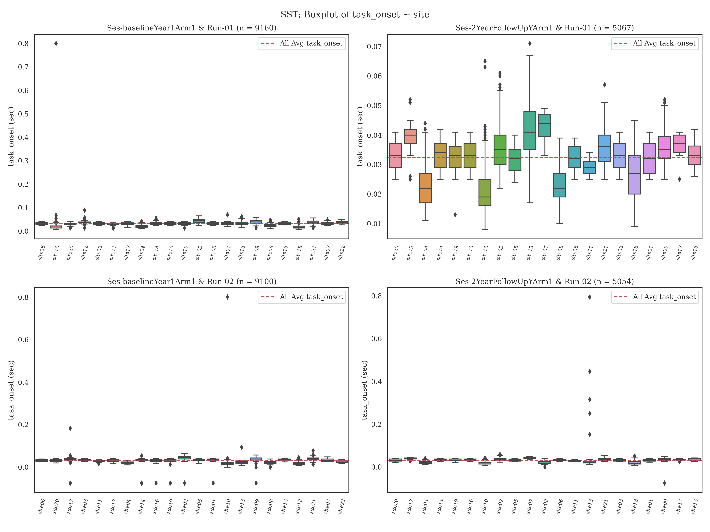

# ABCD-BIDS: Convert & Describe E-Prime Behavioral Data

This folder contains scripts for processing the [ABCD-BIDS dataset](https://collection3165.readthedocs.io/en/stable/).

## Overview

The scripts are divided into **two categories**:
1. **events_to_tsv**: Run the first set of steps in a separate folder (e.g., `events_to_tsv`).
2. **tsv_to_html**: Run the second set in another folder (e.g., `tsv_to_html`).

Key configurations such as the columns extracted from e-prime files ("keep_cols"), the conversion of onset times to seconds ("time_subtract"), 
and the conversion of duration to seconds ("duration_subtract") are maintained in [task_columns.json](./scripts/task_columns.json).

To create folders and place scripts in appropriate locations, run the `MakeFolder` bash script using:
```bash
bash MakeFolders
```
This will move the `events_to_tsv` and `tsv_to_html` folders, subfolders, and associated scripts to expedite the process.

## Updates

### April 18, 2024

A modification was made to the calculation of event onset times in the MID task. Previously, the *PrepTime.Offset* window 
was used due to a misunderstanding of e-prime's 2000ms wait window after the task is triggered following the calibration volumes. 
The revised script now uses *PrepTime.OnsetTime* rather than the *PrepTime.Offset* window. This results in a difference of 2000ms 
and may not have been obvious in group-level maps during testing.

### May 20, 2024

It was confirmed on May 9th by the ABCD consortium that the task-scanner acquisition protocols differed slightly between GE and SIEMENS/Philips. 
Specifically, the tasks started at the _last_ calibration volume (i.e., dummy volume) in GE data but _last calibration + 1TR_ in the SIEMENS/Philips scanners 
(TR = 800ms).

In the previous version of `eprimetotsv.py`, timing files were correct and aligned with volumes only if:
- For GE V25: 4 dummy volumes were removed.
- For GE V26: 15 dummy volumes were removed.

The description in Hagler et al. [2019](https://doi.org/10.1016/j.neuroimage.2019.116091) misreported the calibration, 
so using 5/16 calibration volumes in GE would misalign timings. This is because the tasks are triggered at the 16th/5th 
calibration volume and thus should not be discarded. 

In the current version of `eprimetotsv.py`, the distribution of timings between the scanner trigger and start of the task 
(e.g., MID = PrepTime.OnsetTime) is ~12 seconds (15 TRs/volumes), accounting for the 11 volumes in GE V25 that are collapsed into 1.

The SIEMENS/Philips timings and volumes are correct, with the specified calibration volumes being accurate. The difference 
between "SiemensPad.OnsetTime" and "SiemensPad.OffsetTime + delay" in the e-prime data is ~6.4 seconds (8 TRs/volumes, the number 
of dummy volumes for Philips/Siemens). Comparably, the ABCD release 1.0 - 5.0 contained timings that differed by 300-800ms across tasks in GE data.

Log files have been expanded to specify the e-prime file read type used, the prep variable column conditioned on, and the 
scanner type. Furthermore, quality control plots have been included in the `imgs` folder for each task.

-----
-----

**First, curating and summarizing e-prime behavioral data**. This includes converting e-prime files to .tsv for each subject and run, 
as well as creating numerical (.json) and visual (.png) subject-specific summaries.

1. [eprimetotsv.py](./scripts/eprimetotsv.py): Converts edat/edat2 E-prime *EventsRelatedInformation.txt files pulled from NDA to *_events.tsv files. 
   - Example usage:
  ```bash
  python ./scripts/eprimetotsv.py -i /path/inputeritxt -o /path/outputeventstsv -s NDA123XCC -e baselineYear1Arm1 -r 01 -t MID -z GE
   ```
  

2. [list_eprime_to_tsv.sh](./scripts/misc/list_eprimetotsv.sh) to process a list of files
   - runs on each subject's e-prime file separately (As of May 14, 2024 - review to include scanner into to call to eprimetotsv.py (-z).
   

3. [plot_eventsummary.py](./scripts/misc/plot_eventsummary.py): Sanity check to ensure onsets and difference between triggers is within range of what is "normal" across scanners, sites, and `eventstotsv.py` procedures.
   - These checks are performed after step 1, and the *_events.tsv files are generated. It requires the directory where events subfolders are created. A path where .csv files and .png figures should be saved and nda file with subject, session, scanner, site and software details. **_Be mindful of y-axis range._** The .02-.06sec (20-60ms) deviations are within latency window in e-prime.
   - Example usage:
     ```bash
     python ./scripts/misc/plot_eventsummary.py --beh_inp /path/dir/events-tsv-export --summ_out /path/summary_out --fig_out /path/figure_out --nda_file
     ```
     

4. [summary_taskonsets.py](./scripts/misc/summary_taskonsets.py): Sanity check to ensure the distribution of onsets for tasks is within an expected range.
   - These checks are performed after step 1, and the *_events.tsv files are generated.
   - Example usage:
     ```bash
     python ./scripts/misc/summary_taskonsets.py -i /path/dir-tsv-export -o /path/summary -t MID
     ```
     

**Second**, the following steps involve behavioral data summarization and HTML report generation.

1. [eventsbeh_describe.py](./scripts/eventsbeh_describe.py): Script that summarizes metrics from subject and run-specific task events.tsv files, generating summary .json files and .png images.
   - Runs on individual subjects via:
     ```bash
     python ./scripts/eventsbeh_describe.py -i /path/input-events/ -o /path/output-jsonpngs -s NDA123XCC -e baselineYear1Arm1 -t MID
     ```
     


2. [loop_describeevents.sh](./scripts/misc/loop_describeevents.sh): Script that loops over a list of subjects and describes
describes .tsv files iteratively. Asks for the task and session and assumes location based on current directory (review path setup)
    ```bash
    ./loop_describeevents.sh 
   ```
   

4. [run_htmlreport.py](./scripts/run_htmlreport.py): A script that calls multiple scripts to generate a `group_{task}.csv` and `group_{html}.html`.
   Based on plotting features from [nipreps/mriqc](https://github.com/nipreps/mriqc/). Run the script using:
     ```bash
     python -m ./scripts/run_htmlreport -t MID -i ./baselineYear1Arm1_MID/ -d ./scripts/templates/describe_report_MID.txt -o out_html/
     ```
   - The `-d` flag requires a descriptive file that can be updated, which exists within [scripts/templates](./scripts/templates/).
   

**Caveats:**
- The behavioral `*_events.tsv` files are calculated with the onset time of the first trial associated with the task (not scanner) trigger time.
- The raw BOLD data may include calibration volumes, which may need to be trimmed using a script like [modify_volumesrows.sh](./scripts/misc/modify_volumesrows.sh).

These scripts are a work in progress and will change (some more than others). Currently, the scripts do not reflect the core ABCC procedures.


**Contributions:**
If you catch any errors, please let me know. Some of these scripts have been used and feedback has been provided (Thanks, Farzane Lal Khakpoor!) 
but others may have not. Furthermore, efforts have been taken to meet with the ABCD consortium to correct previous errors from this code and in DAIRC and try to align outputs (Thanks, Don Hagler!). 
If you have expertise in the MID, SST and/or nback task(s), please feel free to contribute to the descriptive text in 
[MID text](./scripts/templates/describe_report_MID.txt), [SST text](./scripts/templates/describe_report_SST.txt) and
[nback](./scripts/templates/describe_report_nback.txt)


### References

```bash
Casey, B. J., Cannonier, T., Conley, M. I., Cohen, A. O., Barch, D. M., Heitzeg, M. M., Soules, M. E., Teslovich, T., Dellarco, D. V., Garavan, H., Orr, C. A., Wager, T. D., Banich, M. T., Speer, N. K., Sutherland, M. T., Riedel, M. C., Dick, A. S., Bjork, J. M., Thomas, K. M., … ABCD Imaging Acquisition Workgroup. (2018). The Adolescent Brain Cognitive Development (ABCD) study: Imaging acquisition across 21 sites. Developmental Cognitive Neuroscience, 32, 43–54. https://doi.org/10.1016/j.dcn.2018.03.001
Chaarani, B., Hahn, S., Allgaier, N., Adise, S., Owens, M. M., Juliano, A. C., Yuan, D. K., Loso, H., Ivanciu, A., Albaugh, M. D., Dumas, J., Mackey, S., Laurent, J., Ivanova, M., Hagler, D. J., Cornejo, M. D., Hatton, S., Agrawal, A., Aguinaldo, L., … Garavan, H. P. (2021). Baseline brain function in the preadolescents of the ABCD Study. Nature Neuroscience, 1–11. https://doi.org/10.1038/s41593-021-00867-9
Esteban, O., Baratz, Z., Markiewicz, C. J., MacNicol, E., Provins, C., & Hagen, M. P. (2023). MRIQC: Advancing the automatic prediction of image quality in MRI from unseen sites [Computer software]. Zenodo. https://doi.org/10.5281/zenodo.8034748
Esteban, O., Birman, D., Schaer, M., Koyejo, O. O., Poldrack, R. A., & Gorgolewski, K. J. (2017). MRIQC: Advancing the automatic prediction of image quality in MRI from unseen sites. PLOS ONE, 12(9), e0184661. https://doi.org/10.1371/journal.pone.0184661
```
