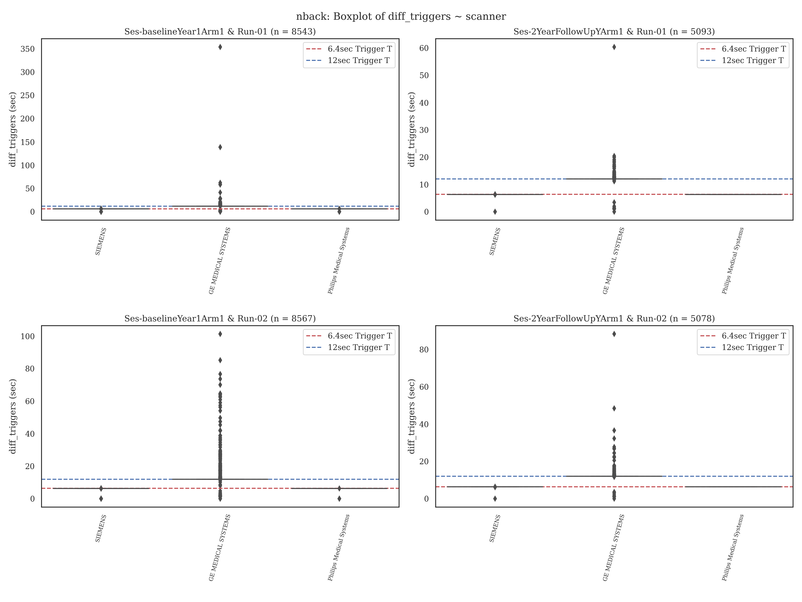

# plts - ABCD-BIDS Events Data Quality Control Plots

In addition to several images used in the git reposity, this _imgs_ folder contains summary plots for the MID, SST and nback
task for runs 01 and 02 across Baseline and 2Year ABCC events file data based on `eprimetotsv.py` conversion of the available ERI files.

The figures focus on separate timing columns for the y-axis in the *events.tsv files.
- OnsetTimes: the plots `*axis-task_onsetby...` are the first trial and cue onsets for each run in the task. In each task these are demarcated by different e-prime task-relevant columns. Dashed red lines are the average of the y-value across all x-values.

  - MID: Cue.OnsetTime
  - nback: CueFix.OnsetTime
  - SST: BeginFix.OnsetTime
- DiffTriggerTimes: the plots `*axis-diff_triggersby...` are the difference (in seconds) between the time of first and last calibration volume. The scanners differ in calibration volumes. Dashed red lines are the target 6.4 & 12sec calibration duration.

  - GE: v25 has 4 total calibration volumes (with 12 are collapsed into one) and v26 has 15 calibration volumes. This means the difference should be ~12secs
  - Siemens/Philips: Both scanners collect 8 calibration volumes. This means the difference should be ~6.4secs

The x-axis varies across several different ABCD and `eprimetotsv.py` relevant variables
- Scanner: the plots `*axis-..byscanner` are the timings across the three scanners
- Software: the plots `*axis-..bysoftware` are the timings across the different scanner software 
- site: the plots `*axis-..bysite` are the timings across the 21 different sites
- Trigger Column: the plots `*axis-..bytrig_col` are the timings across the different initial trigger columns for each task/scanner, e.g. "GetReady.RTTime, SiemensPad.OnsetTime"
- End Calibration Column: the plots `*axis-..bycalibend_col` are the timings across the different final trigger columns for each task/scanner, e.g. "run-specific" or "SiemensPad.OffsetTime+delay"

---

The purpose of the scrits is to quickly assess whether there are odd things going on in these timing estimations from the e-prime data.
Generally, things that are 50-100ms are not extremely problematic with the slow BOLD respond. Nevertheless, when timings differ wildly, this should be inspected further.
Given that during the making of the plots individual .csv files are created with the reports, they can be used for further inspection. Of note, individual *events.tsv files for subjects
include onset and trigger difference warnings when values deviate greater than 1second. 

It is expected that MID task starts 2seconds after the last calibration volume across scanners and sites, as the PrepTime.Onset and PrepTime.Offset columns in e-prime differ by
2seconds +/- some .02-.05 latency periods. For the Stopsignal task, the task starts near zero + some latency after the last calibration volume. For the N-back task,
for GE run 01 _only_ the task starts approximately 500ms + some latency after the last calibration volume and near zero + some latency in all other cases.
