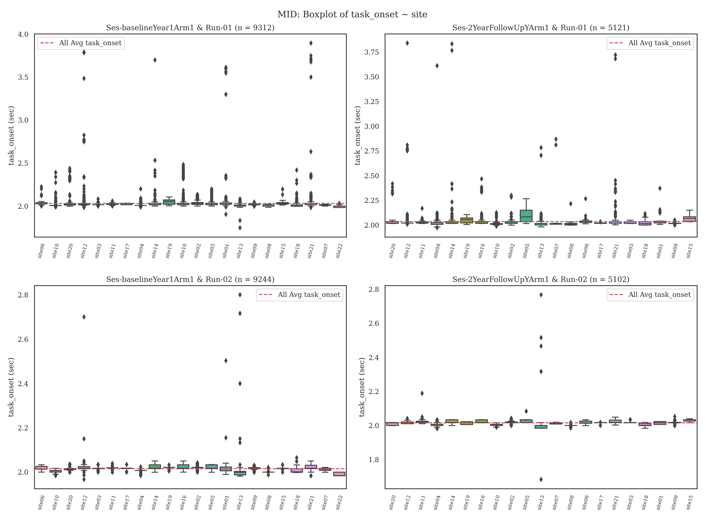
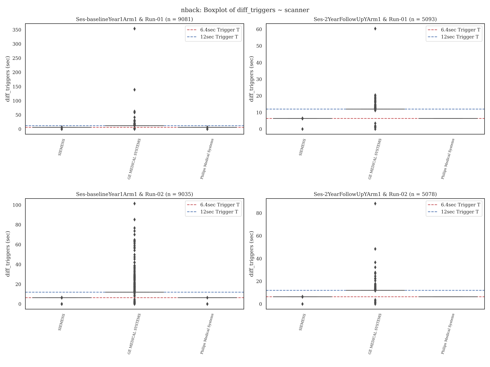

# plts - ABCD-BIDS Events Data Quality Control Plots

This _imgs_ folder contains summary plots for the MID, SST, and n-back tasks for runs 01 and 02 across Baseline and 2Year ABCC events file data, 
based on `eprimetotsv.py` conversion of the available ERI files. Note: the Ns here are relative to the events related information available
through the ABCD-BIDS collection on their NGDR and/or S3 servers. Hence, in some cases there may be fewer subjects. 

## Overview

The figures focus on separate timing columns for the y-axis in the *events.tsv* files:

### OnsetTimes
The plots `*axis-task_onsetby...` show the first trial and cue onsets for each run in the task. In each task, these are demarcated by different e-prime task-relevant columns. Dashed red lines indicate the average of the y-value across all x-values.

- **MID**: Cue.OnsetTime
- **n-back**: CueFix.OnsetTime
- **SST**: BeginFix.OnsetTime

### DiffTriggerTimes
The plots `*axis-diff_triggersby...` show the difference (in seconds) between the time of the first and last calibration volume. The scanners differ in calibration volumes. Dashed red lines indicate the target 6.4 & 12 seconds calibration duration.

- **GE**: v25 has 4 total calibration volumes (with 12 collapsed into one) and v26 has 15 calibration volumes. This means the difference should be ~12 seconds.
- **Siemens/Philips**: Both scanners collect 8 calibration volumes. This means the difference should be ~6.4 seconds.

## X-Axis Variables
The x-axis varies across several different ABCD and `eprimetotsv.py` relevant variables:
- **Scanner**: The plots `*axis-..byscanner` show the timings across the three scanners.
- **Software**: The plots `*axis-..bysoftware` show the timings across the different scanner software.
- **Site**: The plots `*axis-..bysite` show the timings across the 21 different sites.
- **Trigger Column**: The plots `*axis-..bytrig_col` show the timings across the different initial trigger columns for each task/scanner, e.g., "GetReady.RTTime, SiemensPad.OnsetTime".
- **End Calibration Column**: The plots `*axis-..bycalibend_col` show the timings across the different final trigger columns for each task/scanner, e.g., "run-specific" or "SiemensPad.OffsetTime+delay".

---

## Purpose

The scripts are intended to quickly assess whether there are anomalies in these timing estimations from the e-prime data. Generally, differences of 50-100ms are not extremely problematic given the slow BOLD response. However, when timings differ significantly, this should be inspected further.

During the creation of the plots, individual .csv files are generated with the reports, which can be used for further inspection. Individual *events.tsv* files for subjects include onset and trigger difference warnings when values deviate greater than 1 second.

### Task Start Expectations
- **MID task**: Starts 2 seconds after the last calibration volume across scanners and sites, as the PrepTime.Onset and PrepTime.Offset columns in e-prime differ by 2 seconds ± some 0.02-0.05 second latency periods.
- **Stop-signal task**: Starts near zero ± some latency after the last calibration volume.
- **N-back task**: For GE run 01 _only_, the task starts approximately 500ms ± some latency after the last calibration volume and near zero ± some latency in all other cases.
